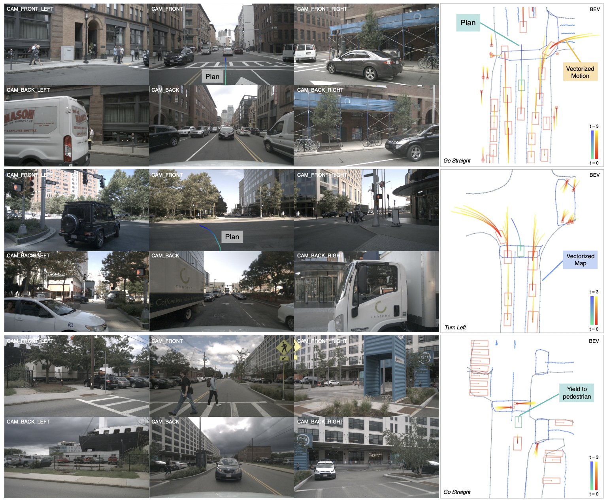

<h1> VAD </h1>
<h3>Vectorized Scene Representation for Efficient Autonomous Driving</h3>

[Bo Jiang](https://github.com/rb93dett)1\*, [Shaoyu Chen](https://scholar.google.com/citations?user=PIeNN2gAAAAJ&hl=en&oi=sra)1\*, Qing Xu2, [Bencheng Liao](https://github.com/LegendBC)1, Jiajie Chen2, [Helong Zhou](https://scholar.google.com/citations?user=wkhOMMwAAAAJ&hl=en&oi=ao)2, [Qian Zhang](https://scholar.google.com/citations?user=pCY-bikAAAAJ&hl=zh-CN)2, [Wenyu Liu](http://eic.hust.edu.cn/professor/liuwenyu/)1, [Chang Huang](https://scholar.google.com/citations?user=IyyEKyIAAAAJ&hl=zh-CN)2, [Xinggang Wang](https://xinggangw.info/)1 :email:
 
1 Huazhong University of Science and Technology, 2 Horizon Robotics

(\*) equal contribution, (:email:) corresponding author.

## Introduction
TL;DR: VAD is a vectorized paradigm for end-to-end autonomous driving.

Autonomous driving requires a comprehensive understanding of the surrounding environment for reliable trajectory planning. Previous works rely on dense rasterized scene representation (e.g., agent occupancy and semantic map) to perform planning, which is computationally intensive and misses the instance-level structure information. In this paper, we propose VAD, an end-to-end  vectorized paradigm for autonomous driving, which models the driving scene as fully vectorized representation. The proposed vectorized paradigm has two significant advantages. On one hand, VAD exploits the vectorized agent motion and map elements as explicit instance-level planning constraints which effectively improves planning safety. On the other hand, VAD runs much faster than previous end-to-end planning methods by getting rid of computation-intensive rasterized representation and hand-designed post-processing steps. VAD achieves state-of-the-art end-to-end planning performance on the nuScenes dataset, outperforming the previous best method by a large margin (reducing the average collision rate by 48.4\%).  Besides, VAD greatly improves the inference speed (up to 9.3x), which is critical for the real-world deployment of an autonomous driving system. Code and models will be released for facilitating future research.

