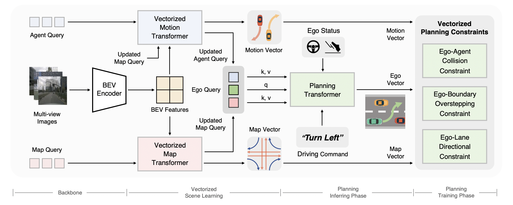

# VAD: Vectorized Scene Representation for Efficient Autonomous Driving

https://user-images.githubusercontent.com/45144254/229673708-648e8da5-4c70-4346-9da2-423447d1ecde.mp4

<br/>

> [**VAD: Vectorized Scene Representation for Efficient Autonomous Driving**](https://arxiv.org/abs/2303.12077)
>
> [Bo Jiang](https://github.com/rb93dett)<sup>1</sup>\*, [Shaoyu Chen](https://scholar.google.com/citations?user=PIeNN2gAAAAJ&hl=en&oi=sra)<sup>1</sup>\*, Qing Xu<sup>2</sup>, [Bencheng Liao](https://github.com/LegendBC)<sup>1</sup>, Jiajie Chen<sup>2</sup>, [Helong Zhou](https://scholar.google.com/citations?user=wkhOMMwAAAAJ&hl=en&oi=ao)<sup>2</sup>, [Qian Zhang](https://scholar.google.com/citations?user=pCY-bikAAAAJ&hl=zh-CN)<sup>2</sup>, [Wenyu Liu](http://eic.hust.edu.cn/professor/liuwenyu/)<sup>1</sup>, [Chang Huang](https://scholar.google.com/citations?user=IyyEKyIAAAAJ&hl=zh-CN)<sup>2</sup>, [Xinggang Wang](https://xinggangw.info/)<sup>1,&#8224;</sup>
> 
> <sup>1</sup> Huazhong University of Science and Technology, <sup>2</sup> Horizon Robotics
>
> \*: equal contribution, <sup>&#8224;</sup>: corresponding author.
>

## News
* **`21 Mar, 2023`:** We release the VAD paper on [Arxiv](https://arxiv.org/abs/2303.12077). Code/Models are coming soon. Please stay tuned! ☕️

## Introduction
> VAD is a vectorized paradigm for end-to-end autonomous driving.

<div align="center">

</div>

- We propose VAD, an end-to-end unified vectorized paradigm for autonomous driving. VAD models the driving scene as fully vectorized representation, getting rid of computationally intensive dense rasterized representation and hand-designed post-processing steps.
- VAD implicitly and explicitly utilizes the vectorized scene information to improve planning safety, via query interaction and vectorized planning constraints.
- VAD achieves SOTA end-to-end planning performance, outperforming previous methods by a large margin. Not only that, because of the vectorized scene representation and our concise model design, VAD greatly improves the inference speed, which is critical for the real-world deployment of an autonomous driving system.

## Catalog
- [ ] Code & Checkpoints Release
- [x] Initialization

## Acknowledgement
VAD is based on the following projects: [mmdet3d](https://github.com/open-mmlab/mmdetection3d), [detr3d](https://github.com/WangYueFt/detr3d), [BEVFormer](https://github.com/fundamentalvision/BEVFormer) and [MapTR](https://github.com/hustvl/MapTR). Many thanks to their excellent contributions to the community.


## Contact
If you have any questions or suggestions about this repo, please feel free to contact us (bjiang@hust.edu.cn, outsidercsy@gmail.com).

## Citation

If you find VAD is useful in your research or applications, please consider giving us a star &#127775; and citing it by the following BibTeX entry.

```BibTeX
@article{jiang2023vad,
  title={VAD: Vectorized Scene Representation for Efficient Autonomous Driving},
  author={Jiang, Bo and Chen, Shaoyu and Xu, Qing and Liao, Bencheng and Chen, Jiajie and Zhou, Helong and Zhang, Qian and Liu, Wenyu and Huang, Chang and Wang, Xinggang},
  journal={arXiv preprint arXiv:2303.12077},
  year={2023}
}
```
