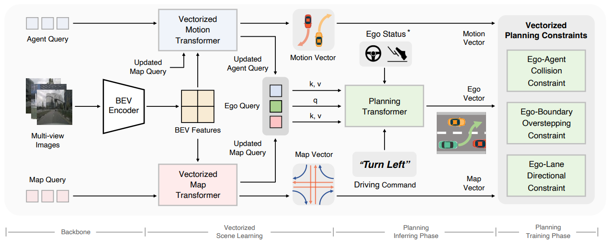

## VAD: Vectorized Scene Representation for Efficient Autonomous Driving

https://user-images.githubusercontent.com/45144254/229673708-648e8da5-4c70-4346-9da2-423447d1ecde.mp4

https://github.com/hustvl/VAD/assets/45144254/153b9bf0-5159-46b5-9fab-573baf5c6159


> [**VAD: Vectorized Scene Representation for Efficient Autonomous Driving**](https://arxiv.org/abs/2303.12077)
>
> [Bo Jiang](https://github.com/rb93dett)<sup>1</sup>\*, [Shaoyu Chen](https://scholar.google.com/citations?user=PIeNN2gAAAAJ&hl=en&oi=sra)<sup>1</sup>\*, Qing Xu<sup>2</sup>, [Bencheng Liao](https://github.com/LegendBC)<sup>1</sup>, Jiajie Chen<sup>2</sup>, [Helong Zhou](https://scholar.google.com/citations?user=wkhOMMwAAAAJ&hl=en&oi=ao)<sup>2</sup>, [Qian Zhang](https://scholar.google.com/citations?user=pCY-bikAAAAJ&hl=zh-CN)<sup>2</sup>, [Wenyu Liu](http://eic.hust.edu.cn/professor/liuwenyu/)<sup>1</sup>, [Chang Huang](https://scholar.google.com/citations?user=IyyEKyIAAAAJ&hl=zh-CN)<sup>2</sup>, [Xinggang Wang](https://xinggangw.info/)<sup>1,&#8224;</sup>
> 
> <sup>1</sup> Huazhong University of Science and Technology, <sup>2</sup> Horizon Robotics
>
> \*: equal contribution, <sup>&#8224;</sup>: corresponding author.
>
>[arXiv Paper](https://arxiv.org/abs/2303.12077), ICCV 2023

## News
* **`1 Aug, 2023`:** Code & models are released!
* **`14 July, 2023`:** VAD is accepted by ICCV 2023🎉! Code and models will be open source soon!
* **`21 Mar, 2023`:** We release the VAD paper on [arXiv](https://arxiv.org/abs/2303.12077). Code/Models are coming soon. Please stay tuned! ☕️

## Introduction
> VAD is a vectorized paradigm for end-to-end autonomous driving.

<div align="center">

</div>

- We propose VAD, an end-to-end unified vectorized paradigm for autonomous driving. VAD models the driving scene as a fully vectorized representation, getting rid of computationally intensive dense rasterized representation and hand-designed post-processing steps.
- VAD implicitly and explicitly utilizes the vectorized scene information to improve planning safety, via query interaction and vectorized planning constraints.
- VAD achieves SOTA end-to-end planning performance, outperforming previous methods by a large margin. Not only that, because of the vectorized scene representation and our concise model design, VAD greatly improves the inference speed, which is critical for the real-world deployment of an autonomous driving system.

## Models

| Method | Backbone | avg. L2 | avg. Col. | FPS | Config | Download |
| :---: | :---: | :---: | :---: |  :---: | :---: | :---: |
| VAD-Tiny | R50 | 0.78 | 0.38 | 16.8 | [config](projects/configs/VAD/VAD_tiny_stage_2.py) | [model](https://drive.google.com/file/d/1KgCC_wFqPH0CQqdr6Pp2smBX5ARPaqne/view?usp=sharing) |
| VAD-Base | R50 | 0.72 | 0.22 | 4.5 | [config](projects/configs/VAD/VAD_base_stage_2.py) | [model](https://drive.google.com/file/d/1FLX-4LVm4z-RskghFbxGuYlcYOQmV5bS/view?usp=sharing) |

## Results
- Open-loop planning results on [nuScenes](https://github.com/nutonomy/nuscenes-devkit). See the [paper](https://arxiv.org/abs/2303.12077) for more details.

| Method | L2 (m) 1s | L2 (m) 2s | L2 (m) 3s | Col. (%) 1s | Col. (%) 2s | Col. (%) 3s | FPS |
| :---: | :---: | :---: | :---: | :---:| :---: | :---: | :---: |
| ST-P3 | 1.33 | 2.11 | 2.90 | 0.23 | 0.62 | 1.27 | 1.6 |
| UniAD | 0.48 | 0.96 | 1.65 | **0.05** | 0.17 | 0.71 | 1.8 |
| VAD-Tiny | 0.46 | 0.76 | 1.12 | 0.21 | 0.35 | 0.58 | **16.8** |
| VAD-Base | **0.41** | **0.70** | **1.05** | **0.07** | **0.17** | **0.41** | 4.5 |

- Closed-loop simulation results on [CARLA](https://github.com/carla-simulator/carla).

| Method | Town05 Short DS | Town05 Short RC | Town05 Long DS | Town05 Long RC |
| :---: | :---: | :---: | :---: | :---:|
| CILRS | 7.47 | 13.40 | 3.68 | 7.19 |
| LBC | 30.97 | 55.01 | 7.05 | 32.09 |
| Transfuser\* | 54.52 | 78.41 | 33.15 | 56.36 |
| ST-P3 | 55.14 | 86.74 | 11.45 | 83.15 |
| VAD-Base | **64.29** | **87.26** | **30.31** | 75.20 |

> \*: LiDAR-based method.

## Getting Started
- [Installation](docs/install.md)
- [Prepare Dataset](docs/prepare_dataset.md)
- [Train and Eval](docs/train_eval.md)
- [Visualization](docs/visualization.md)

## Catalog
- [x] Code & Checkpoints Release
- [x] Initialization

## Contact
If you have any questions or suggestions about this repo, please feel free to contact us (bjiang@hust.edu.cn, outsidercsy@gmail.com).

## Citation
If you find VAD useful in your research or applications, please consider giving us a star &#127775; and citing it by the following BibTeX entry.

```BibTeX
@article{jiang2023vad,
  title={VAD: Vectorized Scene Representation for Efficient Autonomous Driving},
  author={Jiang, Bo and Chen, Shaoyu and Xu, Qing and Liao, Bencheng and Chen, Jiajie and Zhou, Helong and Zhang, Qian and Liu, Wenyu and Huang, Chang and Wang, Xinggang},
  journal={ICCV},
  year={2023}
}
```

## License
All code in this repository is under the [Apache License 2.0](https://www.apache.org/licenses/LICENSE-2.0).

## Acknowledgement
VAD is based on the following projects: [mmdet3d](https://github.com/open-mmlab/mmdetection3d), [detr3d](https://github.com/WangYueFt/detr3d), [BEVFormer](https://github.com/fundamentalvision/BEVFormer) and [MapTR](https://github.com/hustvl/MapTR). Many thanks for their excellent contributions to the community.
